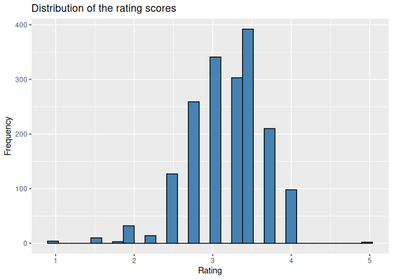
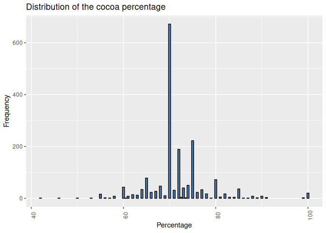
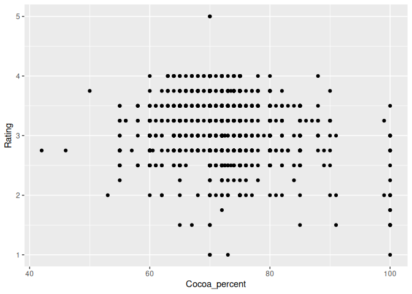
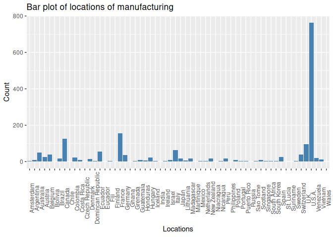
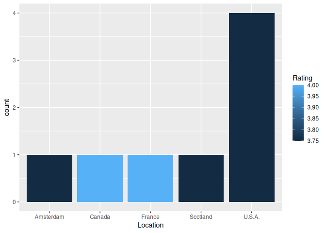
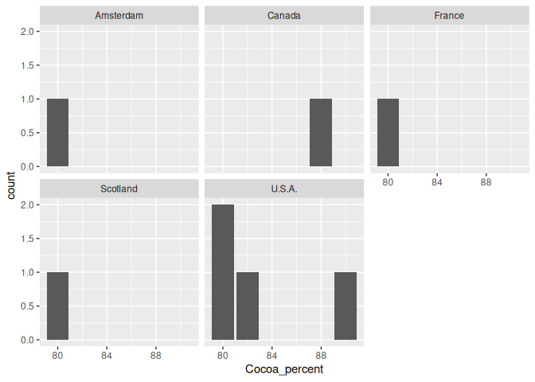

Highest-rated dark chocolate bars by country
================
Oscar Amarilla
2023-08-18

## 1. The client

Chocolate and Tea is an up-and-coming chain of cafes combines an
extensive menu of fine teas with chocolate bars from around the world.
Their diverse selection includes everything from plantain milk
chocolate, to tangerine white chocolate, to dark chocolate with
pistachio and fig. The encyclopedic list of chocolate bars is the basis
of Chocolate and Tea’s brand appeal.

Chocolate bar sales are the main driver of revenue of Chocolate and Tea,
so they aim to serve chocolate bars that are highly rated by
professional critics. The management team regularly updates the
chocolate bar list in order to align with the latest ratings and to
ensure that the list contains bars from a variety of countries. They
also continually adjust the menu to make sure it reflects the global
diversity of chocolate production

## 2. The task

The management team of Chocolate and Tea asked to collect and analyze
data on the latest chocolate ratings. In particular, they’d like to know
which countries produce the highest-rated bars of super dark chocolate
(a high percentage of cocoa).

## 3. Importing the necessary packages

The packages tidyverse, dplyr, ggplot2, and janitor are those required
in this project.

``` r
library(tidyverse)
```

    ## ── Attaching core tidyverse packages ──────────────────────── tidyverse 2.0.0 ──
    ## ✔ dplyr     1.1.2     ✔ readr     2.1.4
    ## ✔ forcats   1.0.0     ✔ stringr   1.5.0
    ## ✔ ggplot2   3.4.2     ✔ tibble    3.2.1
    ## ✔ lubridate 1.9.2     ✔ tidyr     1.3.0
    ## ✔ purrr     1.0.1     
    ## ── Conflicts ────────────────────────────────────────── tidyverse_conflicts() ──
    ## ✖ dplyr::filter() masks stats::filter()
    ## ✖ dplyr::lag()    masks stats::lag()
    ## ℹ Use the conflicted package (<http://conflicted.r-lib.org/>) to force all conflicts to become errors

``` r
library(dplyr)
library(ggplot2)
library(janitor)
```

    ## 
    ## Attaching package: 'janitor'
    ## 
    ## The following objects are masked from 'package:stats':
    ## 
    ##     chisq.test, fisher.test

## 4. The dataset

The dataset received is a csv file that features the latest ratings for
thousands of chocolates from around the world.

### 4.1 Importing the data

``` r
cocoa_df <- read_csv("cacao.csv")
```

    ## Rows: 1795 Columns: 9
    ## ── Column specification ────────────────────────────────────────────────────────
    ## Delimiter: ","
    ## chr (6): Company 
    ## (Maker-if known), Specific Bean Origin
    ## or Bar Name, Cocoa
    ## ...
    ## dbl (3): REF, Review
    ## Date, Rating
    ## 
    ## ℹ Use `spec()` to retrieve the full column specification for this data.
    ## ℹ Specify the column types or set `show_col_types = FALSE` to quiet this message.

``` r
head(cocoa_df)
```

    ## # A tibble: 6 × 9
    ##   `Company \n(Maker-if known)` Specific Bean Origin\nor B…¹   REF `Review\nDate`
    ##   <chr>                        <chr>                        <dbl>          <dbl>
    ## 1 A. Morin                     Agua Grande                   1876           2016
    ## 2 A. Morin                     Kpime                         1676           2015
    ## 3 A. Morin                     Atsane                        1676           2015
    ## 4 A. Morin                     Akata                         1680           2015
    ## 5 A. Morin                     Quilla                        1704           2015
    ## 6 A. Morin                     Carenero                      1315           2014
    ## # ℹ abbreviated name: ¹​`Specific Bean Origin\nor Bar Name`
    ## # ℹ 5 more variables: `Cocoa\nPercent` <chr>, `Company\nLocation` <chr>,
    ## #   Rating <dbl>, `Bean\nType` <chr>, `Broad Bean\nOrigin` <chr>

### 4.2 General information of the dataset

The features of the dataset are the following

``` r
colnames(cocoa_df)
```

    ## [1] "Company \n(Maker-if known)"        "Specific Bean Origin\nor Bar Name"
    ## [3] "REF"                               "Review\nDate"                     
    ## [5] "Cocoa\nPercent"                    "Company\nLocation"                
    ## [7] "Rating"                            "Bean\nType"                       
    ## [9] "Broad Bean\nOrigin"

The columns are defined as:

- **Company (Maker-if known):** Name of the company manufacturing the
  bar.
- **Specific Bean Origin or Bar Name:** The specific geo-region of
  origin for the bar.
- **REF:** A value linked to when the review was entered in the
  database. Higher = more recent.
- **Review Date:** Date of publication of the review.
- **Cocoa Percent:** Cocoa percentage (darkness) of the chocolate bar
  being reviewed.
- **Company Location:** Manufacturer base country.
- **Rating:** Expert rating for the bar.
- **Bean Type:** The variety (breed) of bean used, if provided.
- **Broad Bean Origin:** The broad geo-region of origin for the bean.

Two of the most relevant variables for the business goal are the Cocoa
Percent and the Rating. With respect to the Rating, the value scale is

- 5= Elite (Transcending beyond the ordinary limits)
- 4= Premium (Superior flavor development, character and style)
- 3= Satisfactory(3.0) to praiseworthy(3.75) (well made with special
  qualities)
- 2= Disappointing (Passable but contains at least one significant flaw)
- 1= Unpleasant (mostly unpalatable)

``` r
str(cocoa_df)
```

    ## spc_tbl_ [1,795 × 9] (S3: spec_tbl_df/tbl_df/tbl/data.frame)
    ##  $ Company 
    ## (Maker-if known)       : chr [1:1795] "A. Morin" "A. Morin" "A. Morin" "A. Morin" ...
    ##  $ Specific Bean Origin
    ## or Bar Name: chr [1:1795] "Agua Grande" "Kpime" "Atsane" "Akata" ...
    ##  $ REF                              : num [1:1795] 1876 1676 1676 1680 1704 ...
    ##  $ Review
    ## Date                     : num [1:1795] 2016 2015 2015 2015 2015 ...
    ##  $ Cocoa
    ## Percent                   : chr [1:1795] "63%" "70%" "70%" "70%" ...
    ##  $ Company
    ## Location                : chr [1:1795] "France" "France" "France" "France" ...
    ##  $ Rating                           : num [1:1795] 3.75 2.75 3 3.5 3.5 2.75 3.5 3.5 3.75 4 ...
    ##  $ Bean
    ## Type                       : chr [1:1795] " " " " " " " " ...
    ##  $ Broad Bean
    ## Origin               : chr [1:1795] "Sao Tome" "Togo" "Togo" "Togo" ...
    ##  - attr(*, "spec")=
    ##   .. cols(
    ##   ..   `Company 
    ##   .. (Maker-if known)` = col_character(),
    ##   ..   `Specific Bean Origin
    ##   .. or Bar Name` = col_character(),
    ##   ..   REF = col_double(),
    ##   ..   `Review
    ##   .. Date` = col_double(),
    ##   ..   `Cocoa
    ##   .. Percent` = col_character(),
    ##   ..   `Company
    ##   .. Location` = col_character(),
    ##   ..   Rating = col_double(),
    ##   ..   `Bean
    ##   .. Type` = col_character(),
    ##   ..   `Broad Bean
    ##   .. Origin` = col_character()
    ##   .. )
    ##  - attr(*, "problems")=<externalptr>

### 4.3 Data cleaning and organization

The first thing is to change the name of some columns because they are
in an inconvenient format.

``` r
cocoa_df <- cocoa_df %>% # This method doesn't works with the first row.
  rename(Bean_origin_or_bar_name="Specific Bean Origin\nor Bar Name", Review_date="Review\nDate",
Cocoa_percent="Cocoa\nPercent", Location="Company\nLocation", Bean_type="Bean\nType", Broad_bean_origin="Broad Bean\nOrigin")
cocoa_df <- cocoa_df %>%
    rename_with(~ "Company", 1)
colnames(cocoa_df)
```

    ## [1] "Company"                 "Bean_origin_or_bar_name"
    ## [3] "REF"                     "Review_date"            
    ## [5] "Cocoa_percent"           "Location"               
    ## [7] "Rating"                  "Bean_type"              
    ## [9] "Broad_bean_origin"

The next step is to look for null and other spurious values (empty,
incoherent data, characters instead numbers or vice versa, etc.).

``` r
    null_values <- is.na(cocoa_df)
    col_null_counts <- colSums(null_values)
    col_null_counts
```

    ##                 Company Bean_origin_or_bar_name                     REF 
    ##                       0                       0                       0 
    ##             Review_date           Cocoa_percent                Location 
    ##                       0                       0                       0 
    ##                  Rating               Bean_type       Broad_bean_origin 
    ##                       0                       1                       1

The stakeholder has established that most relevant variables for the
analysis are Rating, Cocoa_percent, and Location. Therefore, the missing
values in the Bean_type and Broad_bean_origin are not relevant for the
analysis, so the analysis has to focus on this variables.

``` r
unique(cocoa_df$Cocoa_percent)
```

    ##  [1] "63%"   "70%"   "60%"   "80%"   "88%"   "72%"   "55%"   "75%"   "65%"  
    ## [10] "85%"   "73%"   "64%"   "66%"   "68%"   "50%"   "100%"  "77%"   "90%"  
    ## [19] "71%"   "83%"   "78%"   "74%"   "76%"   "86%"   "82%"   "69%"   "91%"  
    ## [28] "42%"   "61%"   "73.5%" "62%"   "67%"   "58%"   "60.5%" "79%"   "81%"  
    ## [37] "57%"   "72.5%" "56%"   "46%"   "89%"   "99%"   "84%"   "53%"   "87%"

``` r
unique(cocoa_df$Location)
```

    ##  [1] "France"            "U.S.A."            "Fiji"             
    ##  [4] "Ecuador"           "Mexico"            "Switzerland"      
    ##  [7] "Netherlands"       "Spain"             "Peru"             
    ## [10] "Canada"            "Italy"             "Brazil"           
    ## [13] "U.K."              "Australia"         "Wales"            
    ## [16] "Belgium"           "Germany"           "Russia"           
    ## [19] "Puerto Rico"       "Venezuela"         "Colombia"         
    ## [22] "Japan"             "New Zealand"       "Costa Rica"       
    ## [25] "South Korea"       "Amsterdam"         "Scotland"         
    ## [28] "Martinique"        "Sao Tome"          "Argentina"        
    ## [31] "Guatemala"         "South Africa"      "Bolivia"          
    ## [34] "St. Lucia"         "Portugal"          "Singapore"        
    ## [37] "Denmark"           "Vietnam"           "Grenada"          
    ## [40] "Israel"            "India"             "Czech Republic"   
    ## [43] "Domincan Republic" "Finland"           "Madagascar"       
    ## [46] "Philippines"       "Sweden"            "Poland"           
    ## [49] "Austria"           "Honduras"          "Nicaragua"        
    ## [52] "Lithuania"         "Niacragua"         "Chile"            
    ## [55] "Ghana"             "Iceland"           "Eucador"          
    ## [58] "Hungary"           "Suriname"          "Ireland"

``` r
unique(cocoa_df$Rating)
```

    ##  [1] 3.75 2.75 3.00 3.50 4.00 3.25 2.50 5.00 1.75 1.50 2.25 2.00 1.00

As can be seen, none of these columns contain spurious values, so the
analysis can go on. A new data frame is established in order to reduce
the number of features being manipulated. Before that, has been notice
that the Cocoa_percent values are strings, so these values will be
converted to float.

``` r
cocoa_df$Cocoa_percent <- as.numeric(sub("%", "", cocoa_df$Cocoa_percent))
```

``` r
trimmed_cocoa_df <- cocoa_df %>%
  select(Company, Rating, Cocoa_percent, Location)
colnames(trimmed_cocoa_df)
```

    ## [1] "Company"       "Rating"        "Cocoa_percent" "Location"

### 4.4 Exploratory analysis

The rating distribution will show range of quality of the cocoa bars
considered in the dataset.

``` r
ggplot(data = trimmed_cocoa_df, aes(x = Rating)) +
 # geom_density(color = "red", size = 1) +
  geom_histogram(fill = "steelblue", color = "black") +
  labs(title = "Distribution of the rating scores", x = "Rating", y = "Frequency")
```

    ## `stat_bin()` using `bins = 30`. Pick better value with `binwidth`.

<!-- -->

The products offered are mainly, with respect to the rating,
disappointing to premium, being predominately the presence of 3.5 score
of rating.

``` r
ggplot(data = trimmed_cocoa_df, aes(x = Cocoa_percent)) +
 # geom_density(color = "red", size = 1) +
  geom_histogram(fill = "steelblue", color = "black", stat = "count") +
  theme(axis.text.x = element_text(angle = 90)) +
  labs(title = "Distribution of the cocoa percentage", x = "Percentage", y = "Frequency")
```

    ## Warning in geom_histogram(fill = "steelblue", color = "black", stat = "count"):
    ## Ignoring unknown parameters: `binwidth`, `bins`, and `pad`

<!-- -->

The distribution of the percent of cocoa in the bars doesn’t has a
regular pattern although there is a concentration of products between
the 60% and 80%. The 70% of cocoa chocolate bars are the most common in
the dataset, there is no product with less than 40% of cocoa in their
recipe.

Looking for correlation between the cocoa percentage and the rating, a
plot relating this two variables is shown.

``` r
ggplot(data = cocoa_df) + geom_point(mapping = aes(x = Cocoa_percent, y = Rating))
```

<!-- -->

There is correlation between this two attributes of the chocolate bars.
But what is visible in this plot is that there is a high density area is
the box determined by the box of 2.5 and 4 rating score, and the 60% and
80% of cocoa percent.

Another interesting feature to visualize is the location of the
manufacturing.

``` r
ggplot(data = trimmed_cocoa_df, aes(x = Location)) +
  geom_bar(fill = "steelblue") +
  theme(axis.text.x = element_text(angle = 90)) +
  labs(title = "Bar plot of locations of manufacturing", x = "Locations", y = "Count")
```

<!-- -->

The biggest producer of cocoa bar is the U.S.A., followed by France,
then Canada, and in the fourth place is the U.K..

After this brief analysis, the conclusion is to narrow down the offers
to those bars with a rating equal to or higher than 3.75 points. It has
to be taken into account that Chocolate and Tea, the stakeholders,
consider a bar to be super dark chocolate if the bar’s cocoa percentage
is greater than or equal to 80%. Therefore, it was decided to create a
new data frame that groups those chocolate bars that meet these two
conditions.

``` r
potential_suppliers <- trimmed_cocoa_df %>%
  filter(Rating >= 3.75 & Cocoa_percent >= 80)
potential_suppliers
```

    ## # A tibble: 8 × 4
    ##   Company             Rating Cocoa_percent Location 
    ##   <chr>                <dbl>         <dbl> <chr>    
    ## 1 Chocolate Makers      3.75            80 Amsterdam
    ## 2 Chocolate Tree, The   3.75            80 Scotland 
    ## 3 Ethereal              3.75            80 U.S.A.   
    ## 4 Potomac               3.75            82 U.S.A.   
    ## 5 Pralus                4               80 France   
    ## 6 Rogue                 3.75            80 U.S.A.   
    ## 7 Soma                  4               88 Canada   
    ## 8 Videri                3.75            90 U.S.A.

Finally, the remaining list of potential suppliers has a mean rating
score of 3.8 with a standard deviation of 0.1. The mean cocoa percentage
in the bar recipes is 82.5% with a standard deviation of 4.1. However,
it is important to note that this last value may not be representative
due to the presence of products with 88% and 90% cocoa. Therefore, a
more accurate measure to describe this variable is to look at the median
value, which is 80% cocoa in the bars.

``` r
potential_suppliers %>%
  summarise(mean(Rating),sd(Rating), mean(Cocoa_percent), sd(Cocoa_percent), median(Cocoa_percent))
```

    ## # A tibble: 1 × 5
    ##   `mean(Rating)` `sd(Rating)` `mean(Cocoa_percent)` `sd(Cocoa_percent)`
    ##            <dbl>        <dbl>                 <dbl>               <dbl>
    ## 1           3.81        0.116                  82.5                4.11
    ## # ℹ 1 more variable: `median(Cocoa_percent)` <dbl>

Most of the products offered came from the U.S.A., but the highest
quality chocolate bars are manufactured at France and Canada.

<!-- -->

Finally, the distribution of cocoa percentage of the resulting list
shows that companies at Canada and the U.S.A. are those who offer the
chocolate bars with highest presence of cocoa in their recipe.

<!-- -->

## 4. Conclusions

Through this analysis, the list of 1795 potential suppliers was
successfully narrowed down to just eight. This reduction was based on a
minimum rating score of 3.75 out of 5 and a minimum cocoa percentage of
80%, which is considered as super dark chocolate according to the
stakeholders’ criteria. The suggestion is to focus on two of these eight
suppliers: Pralus, a French company, and Soma, a Canadian company. This
recommendation is supported by the fact that both companies have
received a score of 4 out of 5 from the experts, indicating that their
products exhibit premium quality, characterized by superior flavor
development, character, and style.
